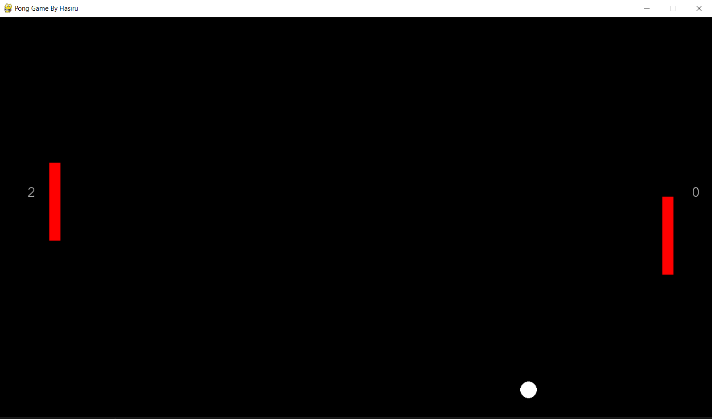

# Demo

Pong Gane by Hasiru 


# Pong Game

This is a simple implementation of the classic Pong game using Python and the Pygame library.



## Table of Contents

- [About the Game](#about-the-game)
- [Features](#features)
- [How to Play](#how-to-play)
- [Installation](#installation)
- [Controls](#controls)
- [Scoring](#scoring)
- [Customization](#customization)
- [Contributing](#contributing)
- [License](#license)

## About the Game

This Pong game is a recreation of the classic arcade game where two players control paddles on opposite sides of the screen, attempting to bounce a ball past each other to score points. The game continues until one player reaches a certain score threshold.

## Features

- Simple and intuitive gameplay.
- Responsive paddle controls using keyboard inputs.
- Dynamic paddle size adjustments based on player performance.
- Real-time scoring display for both players.
- Ball movement and collision mechanics.

## How to Play

1. Clone or download the repository to your local machine.
2. Make sure you have Python and the Pygame library installed (you can install Pygame using `pip install pygame`).
3. Run the `pong_game.py` script to start the game.

## Installation

1. Clone the repository:

   ```bash
   git clone https://github.com/Akthar99/Pong-Game.git

# Controls
Player 1 (Left Paddle):

Move Up: W key
Move Down: S key
Player 2 (Right Paddle):

Move Up: Up arrow key
Move Down: Down arrow key

# Scoring

Each time the ball passes the opponent's paddle and goes out of bounds, the opposing player gains a point.
The first player to reach 3 points wins the game.

# Customization

You can customize the game by modifying the variables in the pong_game.py script. You can change colors, paddle sizes, ball speed, and more to create your own version of the game.

# Contributing

Contributions are welcome! If you have any improvements, bug fixes, or new features to add, please feel free to open an issue or a pull request.

# License

This project is licensed under the MIT License.
